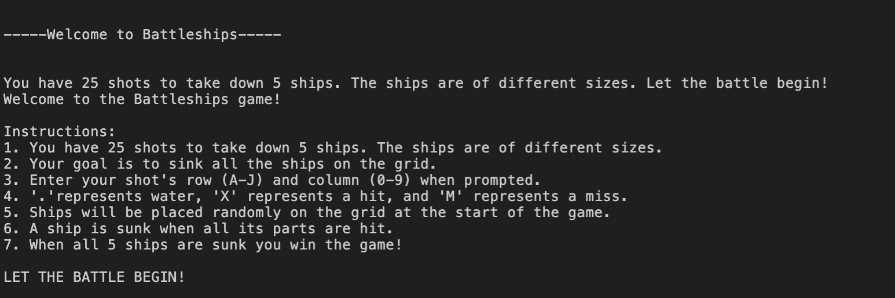

Welcome,

This is the Code Institute student template for deploying your third portfolio project, the Python command-line project. The last update to this file was: **March 14, 2023**

## Reminders

- Your code must be placed in the `run.py` file
- Your dependencies must be placed in the `requirements.txt` file
- Do not edit any of the other files or your code may not deploy properly

## Creating the Heroku app

When you create the app, you will need to add two buildpacks from the _Settings_ tab. The ordering is as follows:

1. `heroku/python`
2. `heroku/nodejs`

You must then create a _Config Var_ called `PORT`. Set this to `8000`

If you have credentials, such as in the Love Sandwiches project, you must create another _Config Var_ called `CREDS` and paste the JSON into the value field.

Connect your GitHub repository and deploy as normal.

## Constraints

The deployment terminal is set to 80 columns by 24 rows. That means that each line of text needs to be 80 characters or less otherwise it will be wrapped onto a second line.

---

Happy coding!

# Battleship Game

This project is a  battleship game to play against a computer. 
This is a Python terminal game which runs in the Code Institute mock terminal on Heroku.
The player needs to find all 5 ships and sink the ships before their 25 shots are up.

# Instructions - How to Play

This version of the game was created entirely within Python. It is designed to be user-friendly and provides the player with instructions on what they need to do and what input is needed to be entered in order to play the game. The goal of the game is to sink 5 ships within 25 shots.

A  10x10 board is created by the computer. It then randomly places ships on the board with ship sizes varying from 0 - 5 spots. In this version I have posted a legend on top. A full stop “.” indicates water or empty space. “O” is part of a ship, “X” indicates a ship that has been hit, and “M” is a shot that lands in water because it has missed a ship. The user wins against the computer if they can hit and sink 5 ships before their 25 shots are used up.

# Resources

This project is based on battleships - read more on [Wikipedia](https://en.wikipedia.org/wiki/Battleship_(game))
Inspiration for my project was taken from [Knowledge Maven](https://www.youtube.com/watch?v=tF1WRCrd_HQ) and [CS Students](https://www.youtube.com/watch?v=MgJBgnsDcF0) Both helped me with ideas for what I wanted my project to look like. 

# Features

## Existing Features

* A 10x10 board is generated by the game
* It is labeled A - J vertically
* It is labeled 0 - 9 horizontally
* The player cannot see the computer’s placement of the 5 ships
* The player plays against the computer
* The player can always see how many ships are left on the board at all times
* The player can always see how many shots are left after every shot
* The game accepts user input for location of shots - F6 for example
* The input is validated to make sure it is in the correct format and so the user cannot input coordinates outside of the grid
* The input is also checked to see if the player has already made the guess shot, so it doesn’t count against them in their shots

Instructions of the game

![The player cannot see where the ships are located (ship locations are “O”)]
Enter input for location of shots
Input incorrect data so game ensures the user inputs only correct data
Hits & misses (X hits, M misses)
Win the game

## Future Features

* Have 2 boards so that the computer can also play against the user
* Allow user to adjust board size and size of ships
* Allow user to put the location of their own ships on the board
* Improve UX/UI so that the game is more visually interesting for the user

# Data Model

I created a board class (create grid) as my model. The game creates a board for the player to play against the computer. It stores the range of the grid 10x10, 5 ships of varying sizes, and the player’s guesses based on 25 shots. 

# Testing

I have manually tested this project through the following:

* Passed the code through a PEP8 Linter and confirmed that there were no issues
* I have passed my code through a python check checker
* I also had friends and family test out my game
* Given it invalid inputs in order to ensure correct input accepted only
* Tested in my local terminal and Code Institute Heroku terminal

# BUGS

## Solved Bugs

* I originally was having issues with check_for_sunk_ship function.  It wasn’t counting the ships correctly. 
* I also had issues with checking for  game_over which  wouldn’t count the number of ships correctly, so the game would not end at the appropriate time.
* Lots of errors of lines being too long when pushed through linter, so I needed to change my code

## Bugs Remaining

* No bugs remaining

# Lessons

* I changed the name of my project in Github midway through and then had issues pushing my code from codeanywhere back to Github. A lot of trial and errors to fix this issue
* Because of summer holiday I spent a lot of time on this project, but with big gaps in-between. This made me struggle when * I would go back to the project, I would forget things I changed or that I needed to fix. So in the future, no more big gaps while working on a project
* Because of the things above, I know that I really need to improve my git comments to have better descriptions and more specific descriptions of what I have done
* The debugging process was a lot of trial and error, but I believe helped me to learn Python better

# Deployment

This project was deployed using Code Institute's mock terminal for Heroku.
Steps for deployment:
* Fork or clone the repository
* Create a new Heroku app
* Set the buildbacks to Python and NodeJS in that order
* Link the Heroku app to the repository
* Click on deploy

# Credits

* Code Institute for the deployment terminal
* Wikipedia for details of the battleships game
* Inspiration for the game taken from  [CS Students](https://www.youtube.com/watch?v=MgJBgnsDcF0) and [Knowledge Mavens](https://www.youtube.com/watch?v=tF1WRCrd_HQ)

